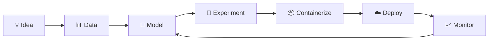

<div align="center">


<br/>


<br/><br/>

### `AI enthusiast turning models into intelligent, scalable systems.`

<br/>

<a href="https://www.linkedin.com/in/abuddhar/">
  
</a>

<a href="mailto:akvbuddharaju@gmail.com">
  
</a>

<br/><br/>


<br/><br/>


</div>

---

## 👋 Who Am I?

```yaml id="w2ia5a"
name: Akshay Krishna Varma

mission:
  "Explore intelligent systems, build scalable AI workflows,
   and turn Machine Learning experiments into real-world applications."

current_focus:
  - MLOps
  - AI Agents

currently_learning:
  - AI Agent architectures
  - Intelligent automation workflows
  - Production-ready AI systems

ask_me_about:
  - Machine Learning
  - Deep Learning
  - Natural Language Processing

interests:
  - Machine Learning & Applied AI
  - Deep Learning
  - Natural Language Processing
  - AI Agents
  - MLOps & Deployment
  - Computer Vision
  - Cloud AI Systems
  - Backend Development
```

---

## 🚀 What I’m Building

```bash id="81m8q4"
$ building mlops-pipelines

  → experiment tracking
  → containerized ML applications
  → deployment automation
  → cloud-ready AI workflows


$ exploring ai-agents

  → intelligent automation
  → agent-based workflows
  → tool-integrated AI systems
  → autonomous task execution


$ experimenting with applied-ai

  → machine learning
  → deep learning
  → natural language processing
  → computer vision
```

---

## 🧠 My AI Playground

```text id="pjwohy"
                    ┌─────────────────────────┐
                    │        AI SYSTEMS       │
                    └────────────┬────────────┘
                                 │
              ┌──────────────────┼──────────────────┐
              │                  │                  │
              ▼                  ▼                  ▼

     MACHINE LEARNING        AI AGENTS           MLOps

     PyTorch                  Agent Systems       MLflow
     TensorFlow               Automation          Docker
     Keras                    Tool Use            Kubernetes
     Scikit-learn             Workflows           GitHub Actions

              │                  │                  │
              └──────────────────┼──────────────────┘
                                 │
                                 ▼

                      CLOUD + DEPLOYMENT

                     AWS • Azure • GCP
```

---

## 🛠️ Tech Stack

### Languages


### Machine Learning & AI


### MLOps & DevOps


### Cloud


### Backend & APIs


### Databases


### Visualization & Apps


---

## ⚡ Core Focus

```diff id="dqgg9z"
+ AI Agents
  → Building and exploring agent-based AI workflows
  → Intelligent automation
  → Tool-integrated AI applications
  → AI workflow orchestration

+ MLOps
  → ML experiment tracking
  → Reproducible ML workflows
  → Containerized AI applications
  → CI/CD automation for ML systems
  → Cloud-ready deployment

+ Machine Learning
  → Data preprocessing
  → Model training
  → Model evaluation
  → ML pipeline development

+ Deep Learning
  → PyTorch
  → TensorFlow
  → Keras
  → GPU-accelerated experimentation

+ Natural Language Processing
  → Language-focused ML systems
  → NLP experimentation
  → AI-powered application development

+ Computer Vision
  → OpenCV applications
  → Deep Learning for visual data
  → NVIDIA CUDA workflows
```

---

## 🌐 Development Ecosystem

```text id="8g9o6d"
Akshay's AI Lab
│
├── 🧠 Artificial Intelligence
│   ├── Machine Learning
│   ├── Deep Learning
│   ├── Natural Language Processing
│   ├── Computer Vision
│   └── AI Agents
│
├── ⚙️ MLOps
│   ├── MLflow
│   ├── Docker
│   ├── Kubernetes
│   └── GitHub Actions
│
├── ☁️ Cloud
│   ├── AWS
│   ├── Microsoft Azure
│   └── Google Cloud
│
├── 🚀 Backend
│   ├── FastAPI
│   ├── Flask
│   ├── Django
│   └── Jinja
│
├── 🗄️ Databases
│   ├── PostgreSQL
│   ├── MongoDB
│   ├── MySQL
│   └── Neo4j
│
└── 📊 Data & Visualization
    ├── Pandas
    ├── NumPy
    ├── Matplotlib
    ├── Plotly
    └── Streamlit
```

---

## 🔄 My Workflow



---

## 🤝 Connect With Me

<div align="center">

### Let’s talk about Machine Learning, Deep Learning, NLP, MLOps, and AI Agents.

<br/>

<a href="https://www.linkedin.com/in/abuddhar/">
  
</a>

<a href="mailto:akvbuddharaju@gmail.com">
  
</a>

<br/><br/>

```text id="8skxz2"
Machine Learning  →  Experiment
MLOps             →  Scale
AI Agents         →  Automate
Cloud             →  Deploy
```

<br/>

⭐ **Building intelligent systems that move from experimentation to real-world deployment.**

<br/>

[](https://visitcount.itsvg.in)

</div>
